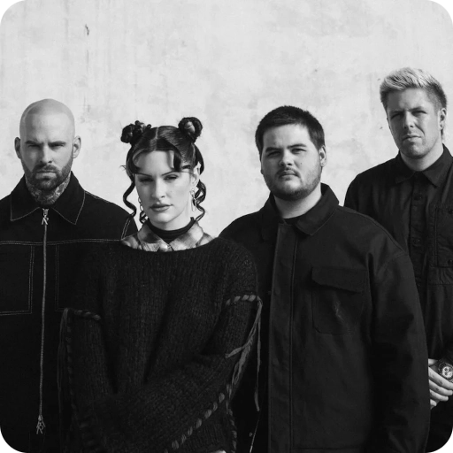
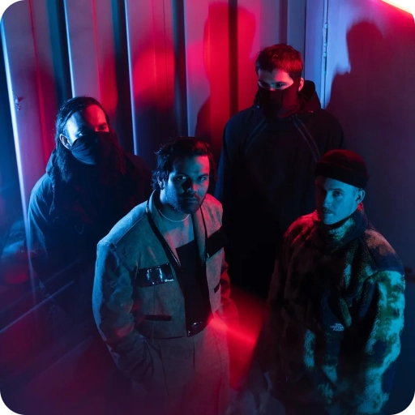
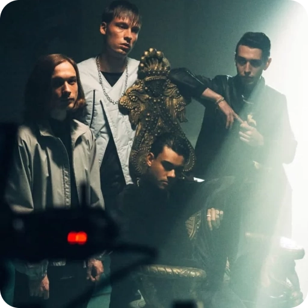

  
    <h3> Hi! 👋 I'm BlackKing72 <i>or Matheus if you prefer</i> </h3>
    
I build things for games, desktop and web.  
    Sometimes to learn, others for fun and sometimes just because why not.

    <!-- 
    <h3> Oi! 👋 Sou o BlackKing72 <i>ou Matheus se preferir</i> </h3>
    
Eu construo coisas para jogos, desktop e web.  
    Às vezes para aprender, outras por diversão e às vezes simplesmente porque sim.
 
    -->
    <a href="README.md">‣ 🇺🇸 English</a>
    &ensp;| &ensp;
    <a href="README_pt-BR.md">🇧🇷 Português</a>

 
 

#### About me

I started with game development in Unity, where I learned C#, which led me to build apps for desktop and more recently for web with React and Node.
<!-- Comecei com desenvolvimento de jogos na Unity, onde aprendi C#, o que me levou a criar apps para desktop e mais recentemente para web com React e Node. -->

In my spare time, I like to explore other languages, the most recent ones being C, Odin and Zig, and frameworks like Astro and Svelte. I also keep going with games, currently learning Godot and recently participated in my first GameJam with a friend.
<!-- Nas horas vagas, gosto de explorar outras linguagens, sendo as mais recentes C, Odin e Zig, e frameworks como Astro e Svelte. Também continuo com os jogos, atualmente aprendendo Godot e recentemente participei da minha primeira GameJam com um amigo. -->

I also do some 3D work, most of them are architectural visualizations, but I also enjoy modeling cars, structures and environments.
<!-- Também faço alguns trabalhos 3D, a maioria são visualizações arquitetônicas, mas também gosto de modelar carros, estruturas e ambientes. -->

 

#### Want to get in touch?
<!-- #### Quer entrar em contato -->

Send me a message on LinkedIn, or, if you prefer, open an issue or discussion on GitBub.
<!-- Mande uma mensagem pelo LinkedIn, ou se preferir, abra um issue ou discussão no GitHub. -->

    
    &ensp;
    

#### A little more about me

Programming takes up most of my time, whether building games, apps or whatever idea comes up. 
<!-- Programar ocupa a maior parte do meu tempo, seja criando games, apps ou qualquer ideia que apareça. -->

When I'm not programming, I like to play games, racing games, rhythm games, pretty much everything *(except Moba, sorry but it's not for me)*. I'm decent at most of them, except platformers and fighting games, which I'm terrible at. I also like to draw, in digital or traditional form, anime, cartoon, cars and scenery. I'm not that great at it, but it's something I enjoy doing.
<!-- Quando não estou programando, gosto de jogar, games de corrida, games de ritmo, quase tudo *(exceto Moba, desculpa mas não dá)*. Geralmente sou ok na maioria deles, exceto jogos de plataforma e de luta que sou péssimo. Também gosto de desenhar, no digital ou tradicional, anime, cartoon, carros ou cenários. Não sou tão bom nisso, mas é algo que gosto de fazer. -->

All of this usually with some music playing in the background. I listen to music most of the time *(I'd say it's rare to see me without my headphones)*, always looking for something new to listen to. Lately I'm listening to a lot of Metal, but I also enjoy HipHop, DnB and recently discovered Rally House.
<!-- Tudo isso geralmente com alguma música tocando de fundo. Eu escuto música a maior parte do tempo, *(diria que é raro me verem sem meu fone de ouvido)*, sempre buscando por algo novo para escutar. Ultimamente tenho escutado bastante Metal, mas também gosto de Hip Hop, DnB e recentemente descobri Rally House. -->

Some of the bands I'm listening to right now:
<!-- Algumas das bandas que estou escutando no momento: -->

<table align="center"><tr align="center">
    <td>
        
         
        Spiritbox
    </td>
    <td>
        
         
        Northlane
    </td>
    <td>
        
         
        Unprocessed
    </td>
</tr></table>

<!--
**BlackKing72/blackking72** is a ✨ _special_ ✨ repository because its `README.md` (this file) appears on your GitHub profile.

Here are some ideas to get you started:

- 🔭 I’m currently working on ...
- 🌱 I’m currently learning ...
- 👯 I’m looking to collaborate on ...
- 🤔 I’m looking for help with ...
- 💬 Ask me about ...
- 📫 How to reach me: ...
- 😄 Pronouns: ...
- ⚡ Fun fact: ...
-->
